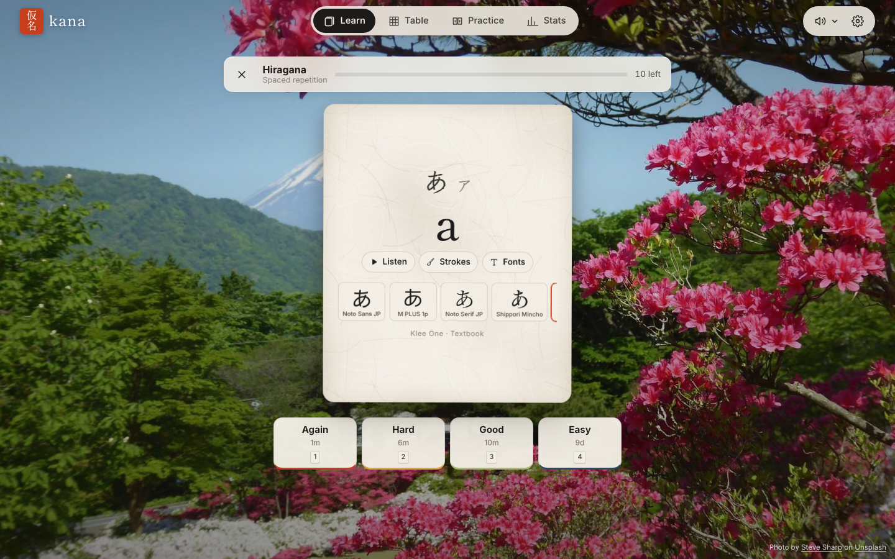
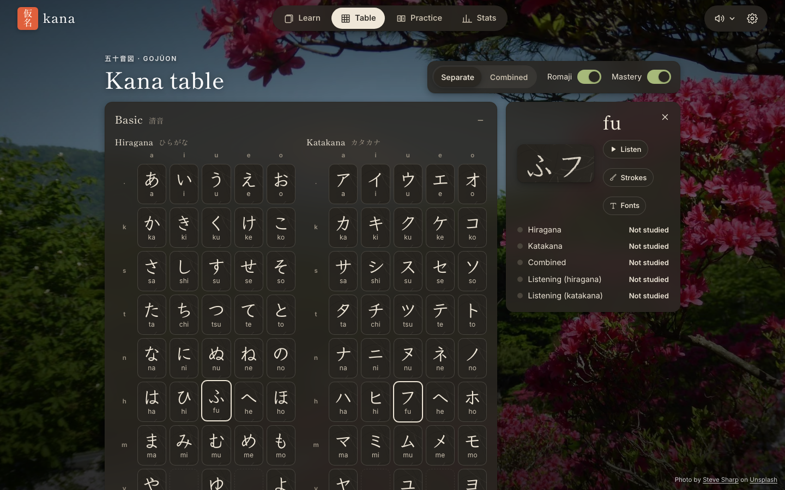

# kana

**Learn to read hiragana and katakana in your browser** — with spaced repetition, real pronunciation,
stroke-order animations and flashcards that look like ink on washi paper.

**→ https://jeroenjanssens.github.io/kana/**





## Features

- **Spaced repetition** (FSRS, the algorithm Anki uses) for three decks: hiragana, katakana, and
  both side by side. Self-grade like Anki, or type the romaji and get a suggested grade.
- **In-order mode** to go through rows one by one without touching your schedule.
- **Kana table** with separate or combined layouts, a romaji toggle, click-to-hear, and a
  mastery overlay that shows how well you know each kana.
- **Pronunciation** for every kana and every reading word, in a female or male voice (or a random one per card), generated with VOICEVOX.
- **Fonts**: pick one of 15 Japanese fonts, or let every card use a random one so you learn to
  recognise kana in any style. A font gallery shows the same kana in every font.
- **Stroke-order animations** for every kana (KanjiVG).
- **Confusable pairs**: compare look-alikes (シ/ツ, ソ/ン, ぬ/め, …) and quiz yourself; sets are
  also built from your own mistakes.
- **Listening**: hear a sound, pick the kana — with its own spaced-repetition schedule.
- **Reading practice**: ~300 real words that unlock as you learn their kana, with short notes on
  っ, ー, long vowels and yōon.
- **Stats**: activity heatmap, streaks, due forecast, mastery per deck, weakest and most-confused kana.
- **Look & feel**: washi-paper cards with ink (every card on its own sheet), photos of Japan
  that rotate by cards, by time, daily or stay fixed, hanko seals for mastered cards, subtle
  traditional sound effects whose pitch follows your answer, light and dark themes.
- **Works offline** and can be installed as an app. Progress stays in your browser; export and
  import it as JSON.

## Development

You need Node.js 22+ and [just](https://github.com/casey/just).

```sh
just install   # install dependencies
just dev       # start the dev server at http://localhost:5173/kana/
just test      # unit tests (Vitest)
just e2e       # end-to-end tests (Playwright)
just ci        # lint, type-check, unit tests, build and e2e — what CI runs
```

Run `just` to see all tasks. The asset pipelines (`just audio` with `just voicevox`, `just fonts`, `just kanjivg`,
`just photos`, `just sfx`, `just icons`) regenerate the files in `public/` and
`src/lib/data/kanjivg/` from their sources; their output is committed, so you only need them
when changing assets.

### Project layout

```
src/
  lib/        plain TypeScript: kana data, SRS, storage, audio engine, stats (unit-tested)
  state/      reactive Svelte state (*.svelte.ts)
  components/ reusable UI (paper card, stroke order, font gallery, charts, …)
  views/      one component per page
scripts/      asset pipelines (audio, fonts, photos, sound effects, stroke data, icons)
tests/        unit/ (Vitest) and e2e/ (Playwright)
```

Pushing to `main` runs the full test suite and deploys to GitHub Pages.

See [PLAN.md](PLAN.md) for the design and decisions.

## Credits

kana builds on the generous work of others — see [NOTICE](NOTICE) and the in-app credits page:
pronunciation generated with VOICEVOX (VOICEVOX:春日部つむぎ, VOICEVOX:青山龍星), stroke data from
KanjiVG (CC BY-SA 3.0), fonts from Google Fonts (OFL), photos from Unsplash, and sound effects
from Freesound (CC0) and a koto recording by Torsodog (Wikimedia Commons, CC BY 3.0).

## License

The code is MIT licensed. Bundled assets keep their own licences, listed in [NOTICE](NOTICE).
